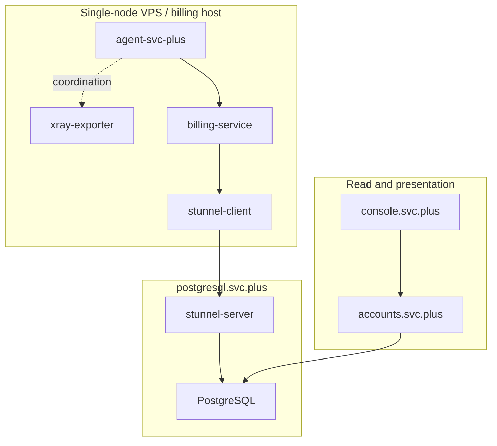
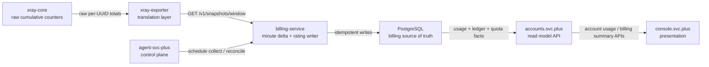

# billing-service architecture

`billing-service` is the billing write model in the Cloud Network Billing &
Control Plane. It consumes normalized traffic snapshots, computes replay-safe
minute deltas, and writes billing truth into PostgreSQL.

Code-level references for the current implementation:

- [design.md](design.md)
- [reference/service.md](reference/service.md)
- [reference/repository.md](reference/repository.md)
- [reference/httpapi.md](reference/httpapi.md)

## Deployment topology

## Data flow

## Role boundaries

- `agent-svc-plus`: control plane scheduling, reconciliation triggers, and
  future automation hooks
- `xray-exporter`: collection and translation layer; it exposes normalized
  snapshots and Prometheus metrics
- `billing-service`: billing writer; it computes positive minute deltas and
  persists replay-safe facts
- `accounts.svc.plus`: PostgreSQL-backed read model; it aggregates usage,
  billing, and quota state for user-facing APIs
- `console.svc.plus`: presentation layer; it reads from `accounts.svc.plus`
  only

## Shared database contract

`billing-service` and `accounts.svc.plus` share the same account database and
schema.

- the database name remains `account`
- on `jp-xhttp-contabo.svc.plus`, `accounts.svc.plus` reaches it through
  `stunnel-client:15432`
- `billing-service` must point `DATABASE_URL` at that same PostgreSQL target so
  writes and reads stay in one source of truth

## Current implementation vs target architecture

### Current implementation

- `billing-service` loads one or more sources from `EXPORTER_SOURCES_JSON`
- if `EXPORTER_SOURCES_JSON` is absent, it still accepts a single
  `EXPORTER_BASE_URL` as a compatibility path
- the upstream snapshot source is `GET /v1/snapshots/window`
- the service is a task-oriented writer with health, status, and job endpoints
- persisted facts land in the existing `accounts.svc.plus` accounting schema

### Target architecture

- `billing-service` remains the write model, but evolves into a multi-node
  aggregation point
- the write path handles multiple exporter feeds or equivalent multi-node sample
  sets without losing `node_id`, `env`, or `inbound_tag`
- remote exporter ingestion must work over HTTPS because exporters are not
  guaranteed to live on the same private network
- the target pull contract must keep source checkpoints and replay-safe
  catch-up explicit and observable across nodes
- `accounts.svc.plus` stays the read model and never delegates user-facing
  usage/billing reads back to `billing-service`

## Target multi-node ingress requirements

For the target architecture, `billing-service` should treat exporter nodes as
remote sources, not implicit local sidecars.

- upstream pulls should use HTTPS with certificate validation enabled
- prefer mTLS between `billing-service` and each `xray-exporter`
- if mTLS is not ready, use HTTPS plus per-source bearer credentials
- source progress must be tracked per exporter node so retries and catch-up stay
  bounded and observable
- billing completeness must come from windowed, replay-safe collection, not
  from assuming the newest snapshot implies nothing was missed
- minute-level sync drift is acceptable; the target is short-window eventual
  consistency rather than second-level strong consistency

## Invariants

- PostgreSQL is the only billing source of truth
- `billing-service` and `accounts.svc.plus` share the same `account` database
- Prometheus and Grafana remain observability only
- `console.svc.plus` does not read PostgreSQL or `billing-service` directly
- `accounts.svc.plus` does not use Prometheus as a billing data source
