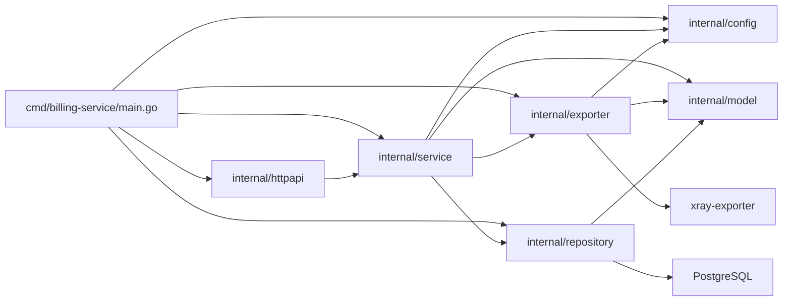
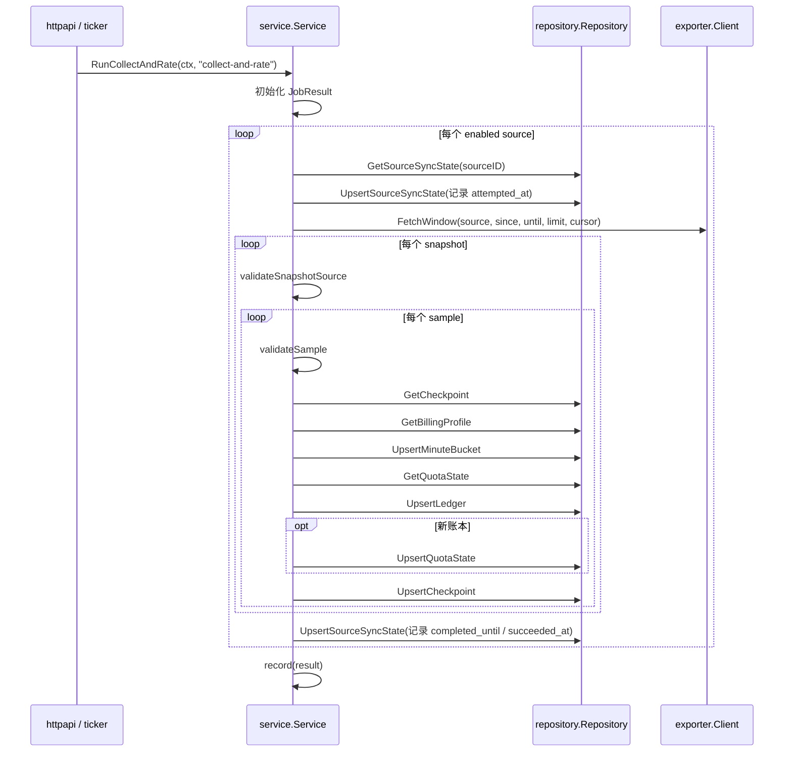

# billing-service 设计说明

本文档面向维护 `billing-service` 的后端工程师，描述当前代码实现下的系统设计、模块边界、主执行流程，以及回放安全与幂等约束。

补充阅读：

- [architecture.md](architecture.md)：部署拓扑、系统边界、目标架构
- [api.md](api.md)：HTTP 任务接口、上下游契约
- [reference/cmd.md](reference/cmd.md)：进程入口与依赖装配
- [reference/service.md](reference/service.md)：服务层与核心业务函数

## 1. 定位与职责

`billing-service` 是 Cloud Network Billing & Control Plane 里的计费写模型。它不承担面向用户的查询职责，只负责把 exporter 提供的累计流量快照转换成可回放、可幂等的分钟计费事实，并写入 PostgreSQL。

当前职责边界：

- 上游：从一个或多个 `xray-exporter` 拉取窗口化快照
- 中间：做来源校验、累计值差分、分钟桶写入、账本写入、配额状态更新、同步状态推进
- 下游：写入与 `accounts.svc.plus` 共享的 `account` 数据库
- 对外：暴露运维任务接口和状态接口，不提供用户账单查询接口

## 2. 运行入口与模块装配

唯一进程入口是 [cmd/billing-service/main.go](/Users/shenlan/workspaces/cloud-neutral-toolkit/billing-service/cmd/billing-service/main.go)。

启动顺序：

1. `config.Load()` 读取环境变量并构造 `config.Config`
2. `sql.Open("pgx", cfg.DatabaseURL)` 建立 PostgreSQL 连接
3. `service.New(cfg, exporter.NewClient(...), repository.NewPostgres(db))` 装配核心依赖
4. `svc.Start(ctx)` 启动后台定时采集循环
5. `httpapi.New(svc).Routes()` 注册 HTTP 路由
6. `http.Server.ListenAndServe()` 启动服务
7. 收到 `SIGINT` / `SIGTERM` 后触发 `Shutdown`

### 模块依赖图

模块职责：

- `internal/config`：环境变量解析、默认值、来源列表装配、镜像信息拆解
- `internal/model`：上游快照、持久化实体、状态返回对象
- `internal/exporter`：对 `xray-exporter` 的 HTTP 客户端
- `internal/repository`：PostgreSQL 读写适配层
- `internal/service`：窗口推进、差分、计费、幂等与状态机
- `internal/httpapi`：任务触发和状态查询 HTTP 层

## 3. 一次 collect-and-rate 的主流程

HTTP `POST /v1/jobs/collect-and-rate` 和后台 ticker 都会进入 `service.Service.RunCollectAndRate`。当前主路径如下：

### 主流程中的关键决定

1. 按来源串行处理
   `RunCollectAndRate` 逐个遍历 `cfg.ExporterSources`，当前实现没有并发采集来源。

2. 以 source sync state 推进窗口
   `collectSource` 基于 `billing_source_sync_state.last_completed_until` 计算下一次拉取窗口，并固定带 2 分钟重叠。

3. 以 checkpoint 做累计值差分
   `processSample` 从 `traffic_stat_checkpoints` 读取上次累计值，计算本次分钟增量。

4. 先写分钟桶，再写账本，再更新配额
   这保证数据层面先有流量事实，再有收费结果，最后才更新账户余额与剩余额度。

5. 以幂等写控制回放
   分钟桶主键和账本主键都可重复 upsert；账本命中已有记录时，不再次扣减余额或配额。

## 4. 回放安全与幂等约束

当前实现依赖以下约束保证“重复拉取窗口不会重复扣费”：

### 4.1 来源窗口重叠

- 常量：`sourceWindowOverlap = 2 * time.Minute`
- 每次采集窗口都会与上一轮完成位置重叠 2 分钟
- 目的：容忍边界分钟重复返回或轻微时钟漂移

### 4.2 分钟桶主键去重

`traffic_minute_buckets` 主键：

- `bucket_start`
- `node_id`
- `account_uuid`
- `region`
- `line_code`

同一分钟、同节点、同账户、同地域、同线路的桶再次写入只会更新，不会生成第二条记录。

### 4.3 账本 ID 确定性生成

`deterministicLedgerID(bucket)` 基于以下字段生成 SHA-1 UUID：

- `bucket_start`
- `node_id`
- `account_uuid`
- `region`
- `line_code`

因此同一个分钟桶重复处理时会命中同一条账本记录。

### 4.4 配额只在“新账本”时变更

`processSample` 只有在 `UpsertLedger` 返回 `ledgerExisted == false` 时才会：

- 扣减 `RemainingIncludedQuota`
- 更新 `CurrentBalance`
- 推进 `LastRatedBucketAt`
- 写回 `account_quota_states`

这避免回放窗口重复扣费。

### 4.5 负差分重置保护

如果 exporter 返回的累计值比 checkpoint 更小，当前实现认为上游累计计数器发生了重置：

- 增加 `reset_epoch`
- 直接更新 checkpoint
- 不生成分钟桶、不生成账本、不更新配额

这条路径的目标是防止负流量差分污染账本。

## 5. 当前配置来源

配置由 `internal/config.Load()` 从环境变量读取。关键项：

- 必填：`DATABASE_URL`、`INTERNAL_SERVICE_TOKEN`
- 来源配置主路径：`EXPORTER_SOURCES_JSON`
- 当前兼容路径：`EXPORTER_BASE_URL`
- 监听与计费默认值：`LISTEN_ADDR`、`COLLECT_INTERVAL`、`SOURCE_REVISION`、`PRICE_PER_BYTE`、`INITIAL_INCLUDED_QUOTA_BYTES`、`INITIAL_BALANCE`

当前建议：

- 使用 `EXPORTER_SOURCES_JSON` 明确声明一个或多个来源
- 仅把 `EXPORTER_BASE_URL` 视为当前仍保留的兼容入口，不作为主设计

详细字段见 [reference/config.md](reference/config.md)。

## 6. 数据持久化设计

当前实现直接依赖以下 PostgreSQL 表：

- `traffic_stat_checkpoints`
- `traffic_minute_buckets`
- `billing_ledger`
- `account_quota_states`
- `account_billing_profiles`
- `billing_source_sync_state`

表结构参考：

- [../sql/billing-service-schema.sql](../sql/billing-service-schema.sql)
- [reference/repository.md](reference/repository.md)

数据职责分层：

- checkpoint：累计值差分基线
- minute bucket：分钟级流量事实
- ledger：收费事实与余额快照
- quota state：账户剩余额度、余额、欠费与节流状态
- billing profile：按账户覆盖默认定价
- source sync state：来源窗口推进与失败信息

## 7. 上下游边界

### 上游边界

当前代码事实：

- 使用 `GET /v1/snapshots/window`
- 通过 `Authorization: Bearer <INTERNAL_SERVICE_TOKEN>` 认证
- 查询参数：`since`、`until`、`limit`、`cursor`

`service.collectSource` 还会基于 `ExpectedNodeID` 和 `ExpectedEnv` 校验来源是否与配置匹配。

### 下游边界

`billing-service` 只写 PostgreSQL，不承担用户查询。

读路径固定为：

`console.svc.plus` -> `accounts.svc.plus` -> PostgreSQL

因此 `billing-service` 的 `/v1/status` 仅用于运维，不是用户账单查询 API。

## 8. 当前实现与后续演进

### 当前实现

- 服务内串行遍历来源
- 依赖 exporter 提供窗口接口
- 定价规则以默认配置 + `account_billing_profiles` 覆盖为主
- 写路径与 `accounts.svc.plus` 共享同一个 `account` 数据库

### 后续演进

未来目标和跨节点 HTTPS 架构，继续以以下文档为准：

- [architecture.md](architecture.md)
- [api.md](api.md)
- [multi-node-https-plan.md](multi-node-https-plan.md)

本设计文档不把目标态混入当前实现说明；如果未来代码演进到目标态，应同步更新本文件与 `docs/reference/*`。
