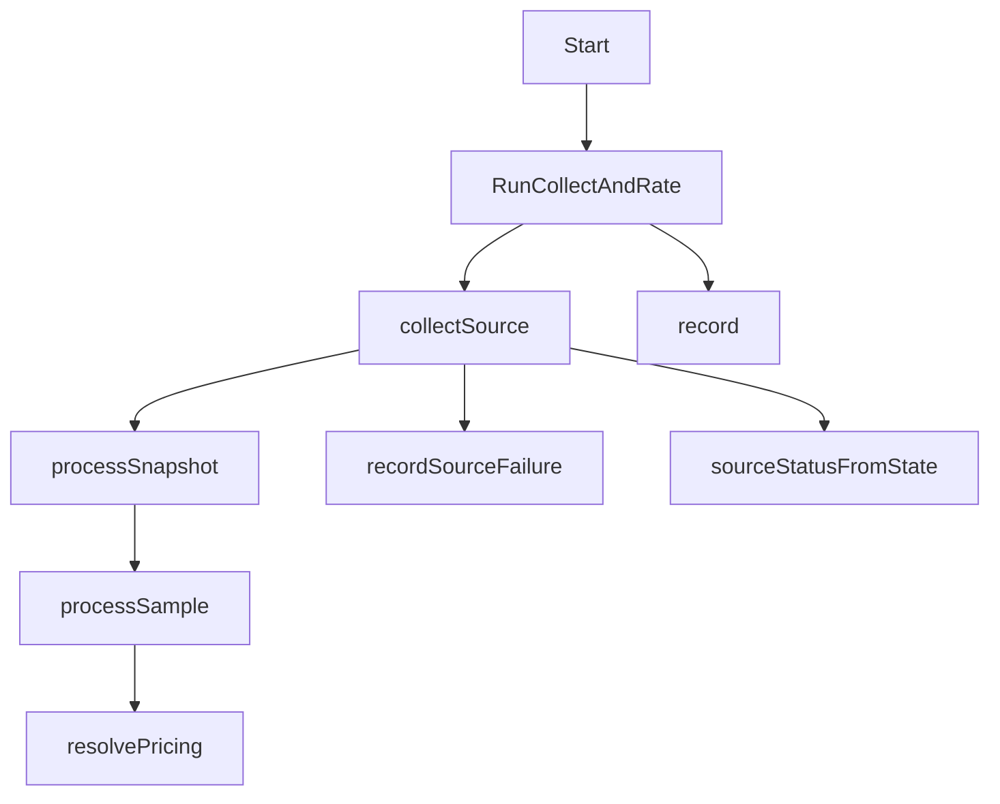

# service 包参考

本文档覆盖 `internal/service/service.go`，这是仓库的核心业务层。

## 包职责

`internal/service` 负责把窗口化快照转换成计费事实。它串联：

- 来源窗口推进
- 快照与样本校验
- 累计值差分
- 分钟桶写入
- 账本写入
- 配额状态推进
- 来源同步状态记录
- 最近一次任务结果缓存

## 调用链总览

## 类型

### `windowSource`

签名：`type windowSource interface`

| 方法 | 作用 |
| --- | --- |
| `FetchWindow(...)` | 抽象上游窗口拉取能力，便于用 `exporter.Client` 或测试桩替换 |

### `Service`

签名：`type Service struct`

| 字段 | 类型 | 含义 |
| --- | --- | --- |
| `cfg` | `config.Config` | 运行配置 |
| `source` | `windowSource` | 上游窗口数据源 |
| `repo` | `repository.Repository` | 仓储接口 |
| `mu` | `sync.Mutex` | 保护最近一次任务状态 |
| `lastResult` | `model.JobResult` | 最近一次任务结果 |
| `lastOK` | `bool` | 最近一次任务是否非 `error` |
| `lastError` | `string` | 最近一次任务错误信息 |

### `effectivePricing`

签名：`type effectivePricing struct`

| 字段 | 类型 | 含义 |
| --- | --- | --- |
| `includedQuotaBytes` | `int64` | 最终生效的包含流量 |
| `basePricePerByte` | `float64` | 最终生效的单价 |
| `multiplier` | `float64` | 最终生效的乘数 |
| `pricingRuleVersion` | `string` | 最终生效的规则版本 |

## 公共函数与方法

### `New`

- 签名：`func New(cfg config.Config, source windowSource, repo repository.Repository) *Service`
- 参数：
  - `cfg`：运行配置
  - `source`：上游来源适配器
  - `repo`：持久化适配器
- 返回：
  - `*Service`
- 职责：
  - 构造核心业务服务
- 调用位置：
  - `cmd/billing-service/main.go`
- 主要副作用：无
- 错误/边界条件：
  - 不校验参数是否为 `nil`

### `Start`

- 签名：`func (s *Service) Start(ctx context.Context)`
- 参数：
  - `ctx`：进程级生命周期上下文
- 返回：无
- 职责：
  - 启动后台 goroutine
  - 先执行一次 `collect-and-rate`
  - 再按 `cfg.CollectInterval` 周期性执行
- 调用位置：
  - `cmd/billing-service/main.go`
- 主要副作用：
  - 启动 goroutine
  - 周期性访问上游和数据库
- 错误/边界条件：
  - 后台调用忽略 `RunCollectAndRate` 返回值，失败只反映到 `lastResult` / `healthz`

### `RunCollectAndRate`

- 签名：`func (s *Service) RunCollectAndRate(ctx context.Context, job string) (model.JobResult, error)`
- 参数：
  - `ctx`：请求或后台上下文
  - `job`：作业名，通常为 `collect-and-rate` 或 `reconcile`
- 返回：
  - `model.JobResult`：本次执行结果
  - `error`：当整体状态为 `error` 时返回
- 职责：
  - 初始化一次作业结果
  - 遍历全部启用来源
  - 聚合来源级状态与错误
  - 记录最终结果到内存状态
- 调用位置：
  - `Start`
  - `httpapi.collectAndRate`
  - `httpapi.reconcile`
- 主要副作用：
  - 持有 `s.mu`
  - 调用上游来源和仓储
  - 更新 `lastResult`、`lastOK`、`lastError`
- 错误/边界条件：
  - 没有任何启用来源时把状态置为 `error`
  - 部分来源失败但仍处理到部分样本时，把状态置为 `partial`
  - 状态为 `error` 时返回聚合错误

### `Status`

- 签名：`func (s *Service) Status() model.JobResult`
- 参数：无
- 返回：最近一次 `JobResult`
- 职责：
  - 在线返回最近一次作业结果快照
- 调用位置：
  - `httpapi.status`
- 主要副作用：
  - 获取互斥锁
- 错误/边界条件：
  - 进程刚启动且尚未执行时会返回零值 `JobResult`

### `Health`

- 签名：`func (s *Service) Health() (bool, string)`
- 参数：无
- 返回：
  - `bool`：最近一次任务是否非 `error`
  - `string`：最近一次错误字符串
- 职责：
  - 为 `/healthz` 提供简化健康状态
- 调用位置：
  - `httpapi.healthz`
- 主要副作用：
  - 获取互斥锁
- 错误/边界条件：
  - 健康状态只代表最近一次执行，不代表数据库连通性即时探测

### `Ping`

- 签名：`func (s *Service) Ping() model.PingInfo`
- 参数：无
- 返回：`model.PingInfo`
- 职责：
  - 返回运行镜像身份信息
- 调用位置：
  - `httpapi.ping`
- 主要副作用：无
- 错误/边界条件：
  - 当 `IMAGE` 未正确注入时，返回空字段而不是伪造值

## 核心内部流程函数

### `collectSource`

- 签名：`func (s *Service) collectSource(ctx context.Context, source config.ExporterSource, result *model.JobResult) (model.SourceStatus, error)`
- 参数：
  - `ctx`：上下文
  - `source`：单个来源配置
  - `result`：当前作业结果，用于累计统计
- 返回：
  - `model.SourceStatus`：该来源的同步状态摘要
  - `error`：该来源失败时返回
- 职责：
  - 读取和初始化来源同步状态
  - 计算当前窗口的 `since` / `until`
  - 分页拉取来源快照
  - 校验来源 `node_id` / `env`
  - 调用 `processSnapshot`
  - 更新完成位置与成功时间
- 调用位置：
  - `RunCollectAndRate`
- 主要副作用：
  - 读写 `billing_source_sync_state`
  - 调用外部 exporter
  - 推进 `result.SourceStatuses`
- 错误/边界条件：
  - `HasMore=true` 但 `NextCursor` 为空时视为错误
  - `NextCursor` 不是 RFC3339 时间时视为错误
  - 当 `since.After(until)` 时，认为本轮无需采集，但仍会推进 `last_completed_until`

### `processSnapshot`

- 签名：`func (s *Service) processSnapshot(ctx context.Context, snapshot model.Snapshot, result *model.JobResult) (bool, error)`
- 参数：
  - `ctx`：上下文
  - `snapshot`：单个快照
  - `result`：当前作业结果
- 返回：
  - `bool`：该快照是否至少成功处理了一个样本
  - `error`：某个样本进入致命错误路径时返回
- 职责：
  - 遍历快照中的全部样本
  - 调用 `validateSample`
  - 对合法样本调用 `processSample`
  - 递增 `ProcessedSamples`
- 调用位置：
  - `collectSource`
- 主要副作用：
  - 更新 `result`
- 错误/边界条件：
  - 非法 UUID 不会中断整张快照，只把作业标记为 `partial`
  - `processSample` 返回错误时中断该快照处理

### `processSample`

- 签名：`func (s *Service) processSample(ctx context.Context, snapshot model.Snapshot, sample model.Sample, result *model.JobResult) (bool, error)`
- 参数：
  - `ctx`：上下文
  - `snapshot`：所属快照
  - `sample`：单个账户样本
  - `result`：当前作业结果
- 返回：
  - `bool`：该样本是否成功进入分钟桶/账本处理路径
  - `error`：读取或写入持久化失败时返回
- 职责：
  - 组合 `storageNodeID`
  - 读取 checkpoint 并计算累计值差分
  - 检测负差分并执行 reset 保护
  - 读取计费配置与配额状态
  - 生成并 upsert 分钟桶
  - 生成并 upsert 账本
  - 在新账本场景下更新配额状态
  - 最后更新 checkpoint
- 调用位置：
  - `processSnapshot`
- 主要副作用：
  - 访问 5 张表：checkpoint、minute bucket、ledger、quota state、billing profile
  - 可能修改 `result.WrittenMinutes` / `result.ReplayedMinutes`
- 错误/边界条件：
  - 负差分时仅更新 checkpoint 并返回 `false, nil`
  - `minuteExisted` 会增加一次 `ReplayedMinutes`
  - `ledgerExisted` 也会增加一次 `ReplayedMinutes`
  - 当 `quota == nil` 时会按默认配置初始化账户状态

## 辅助函数分组

### 定价与数值辅助

| 函数 | 签名 | 参数 | 返回 | 职责 | 调用位置 | 副作用 / 边界条件 |
| --- | --- | --- | --- | --- | --- | --- |
| `resolvePricing` | `func resolvePricing(profile *model.BillingProfile, cfg config.Config) effectivePricing` | `profile`、`cfg` | `effectivePricing` | 计算最终生效的包含流量、单价、乘数、规则版本 | `processSample` | `profile == nil` 时回退到配置默认值；乘数 <= 0 时回退到 `1.0` |
| `minInt64` | `func minInt64(a, b int64) int64` | `a`、`b` | `int64` | 返回较小值，用于计算本次消耗的包含流量 | `processSample` | 无副作用 |

### 校验与标识辅助

| 函数 | 签名 | 参数 | 返回 | 职责 | 调用位置 | 副作用 / 边界条件 |
| --- | --- | --- | --- | --- | --- | --- |
| `validateSample` | `func validateSample(sample model.Sample) error` | `sample` | `error` | 校验样本 UUID 非空且可解析 | `processSnapshot` | 非法 UUID 返回错误字符串 |
| `validateSnapshotSource` | `func validateSnapshotSource(snapshot model.Snapshot, source config.ExporterSource) error` | `snapshot`、`source` | `error` | 校验来源返回的 `node_id` / `env` 是否符合配置 | `collectSource` | 仅当 `ExpectedNodeID` 或 `ExpectedEnv` 非空时才校验 |
| `deterministicLedgerID` | `func deterministicLedgerID(bucket model.MinuteBucket) string` | `bucket` | `string` | 基于分钟桶生成确定性账本 ID | `processSample` | 使用 SHA-1 UUID；同桶重复处理会命中同一 ID |
| `composeStorageNodeID` | `func composeStorageNodeID(env, nodeID string) string` | `env`、`nodeID` | `string` | 组合存储层节点 ID | `processSample` | `env` 为空时仅返回 `nodeID` |

### 错误与状态辅助

| 函数 | 签名 | 参数 | 返回 | 职责 | 调用位置 | 副作用 / 边界条件 |
| --- | --- | --- | --- | --- | --- | --- |
| `joinError` | `func joinError(existing, next string) string` | `existing`、`next` | `string` | 把多段错误信息拼接为一个字符串 | `RunCollectAndRate`、`processSnapshot`、`recordSourceFailure` | 已有错误时用 `; ` 连接 |
| `sourceStatusFromState` | `func sourceStatusFromState(state model.SourceSyncState) model.SourceStatus` | `state` | `model.SourceStatus` | 把持久化状态转换成对外返回状态 | `collectSource`、`recordSourceFailure` | 会复制时间指针，避免共享内部地址 |
| `copyTimePtr` | `func copyTimePtr(value *time.Time) *time.Time` | `value` | `*time.Time` | 复制时间指针并转为 UTC | `sourceStatusFromState`、测试中的 clone 辅助 | `nil` 输入返回 `nil` |
| `recordSourceFailure` | `func (s *Service) recordSourceFailure(ctx context.Context, state model.SourceSyncState, err error) (model.SourceStatus, error)` | `ctx`、`state`、`err` | `model.SourceStatus`、`error` | 记录来源失败信息并返回状态摘要 | `collectSource` | 若持久化失败，会把“持久化失败信息”附加到 `LastError` 文本，但仍返回原始 `err` |
| `record` | `func (s *Service) record(result model.JobResult)` | `result` | 无 | 刷新内存中的最近一次任务状态 | `RunCollectAndRate` | 更新 `lastResult`、`lastError`、`lastOK` |

## 关键不变量

- `RunCollectAndRate` 使用 `s.mu` 串行化整次执行，避免并发更新 `lastResult`
- 来源窗口推进状态来自 `billing_source_sync_state`
- 流量幂等依赖分钟桶主键与确定性账本 ID 的双重约束
- 配额状态只有在新账本写入时才前进
- checkpoint 永远在样本处理末尾写回，负差分时走重置路径
